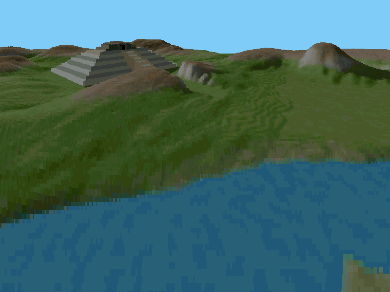

This project is based on the excellent Voxel Space tutorial by Sebastian Macke:
[VoxelSpace](https://github.com/s-macke/VoxelSpace).

# Build

First you need a toolchain.

On a Linux system you can probably get one from the distribution.
For instance on Ubuntu:
```
$ sudo apt install gnat gprbuild
```
On Windows you can download GNAT Community: [here](https://www.adacore.com/download).

This project uses Alire (the Ada package manager). You have to install it
following the instructions here:
https://github.com/alire-project/alire#installation

Then you can build the project with this command:
```
$ alr build
```

# Run
```
$ alr run
```

# Controls
 - `Up arrow`: Move forward
 - `Down arrow`: Move backward
 - `Left arrow`: Turn left
 - `Right arrow`: Turn right
 - `Page Up`: Move up
 - `Page Down`: Move down
 - `Escape`: Quit
